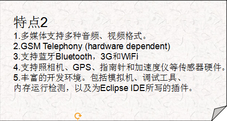
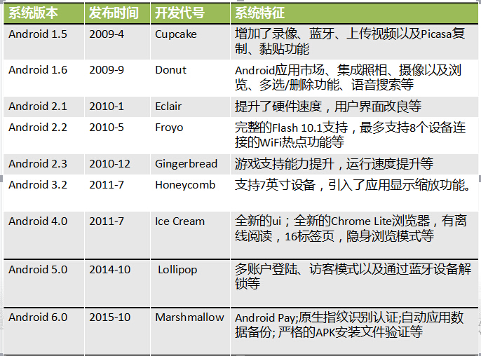

# Android的发展与历史
---
**Android系统的产生**
* 安迪鲁宾是一位硅谷著名的极客，他曾先后在苹果、General Magic、WebTV等公司工作，2000年参与创办了Danger公司。该公司生产的Hiptop(T-Mobile Sidekick)智能手机具备上网、全键盘和照相功能，2003年曾在美国风行一时。
    离开Danger之后，安迪鲁宾创办了新的公司，致力于研发手机操作系统。因为Linus Torvalds把自己写的操作系统称为Linux，安迪鲁宾的名字是Andrew（Andy为Andrew 的昵称），再加上他本身是个机器人迷，所以新公司取名叫做Android。

* 2005年7月，成立仅22个月的Android公司被急于开拓无线互联网业务的Google收购，安迪鲁宾也随 Android加入了Google,继续领导手机操作系统的开发。也就是从这个时候起，业界就开始盛传Google（Google）公司将进军移动通信市场，并推出自主品牌的移动终端产品。更有人将其与苹果公司刚刚推出的iPhone相提并论，取名为“Gphone”，而网络上关于Gphone的各种猜想图片也是满天飞。
* 在沸沸扬扬传了两年多，经过无数次的媒体报道和猜测之后，2007年11月5日Google终于公布了答案，令人意外地是并没有出现传说中的Google Phone或GPhone。Google宣布与其他33家手机制造商(包含摩托罗拉、宏达电、三星、LG)、手机芯片供货商、软硬件供货商、电信运营商(包括中国移动)联合组成开放手机联盟(Open Handset Alliance)，发布了名为Android 的开放手机软硬件平台。
* 2008年9月23日，Google与美国电信运营商T-Mobile联合在纽约正式发布第一款Google手机——T-Mobile G1。该款手机由HTC制造，内部研发代号为Dream（中文含义：梦想），是世界上第一部搭载Android操作系统的手机。

**开放手机联盟(Open Handset Alliance)**
* 开放手机联盟，Open Handset Alliance：是美国Google 公司与2007 年11 月5 日宣布组建的一个全球性的联盟组织。
* 联盟将会支持Google 发布的Android 手机操作系统或者应用软件，共同开发名为Android 的开放源代码的移动系统。
* 开放手机联盟包括手机制造商、手机芯片厂商和移动运营商几类。目前，联盟成员数量已经达到了43 家。

**Android特点及优势**
* Android底层构建在 Linux 2.6内核上。
* Android软件系列包括操作系统、中间件、用户界面和应用软件。

* 源代码完全开放，便于开发人员更清楚的把握实现细节，便于提高开发人员的技术水平，有利于开发出更具差异性的应用。
* 采用了对有限内存、电池和CPU优化过的虚拟机Dalvik，Android 的运行速度比想象的要快很多。
* 运营商（中国移动等）的大力支持，产业链条的热捧。
* 良好的盈利模式，产业链条的各方：运营商、制造商、独立软件生产商都可以获得不错的利益。将移动终端的评价标准从硬件向软件转变，极大的激发了软件开发者的热情。
* Android 的源代码遵循Apache v2软件许可，而不是通常的GPL v2许可,有利于商业开发。具有强大的Linux 社区的支持。

**Android平台版本的演化发展**

Android平台更新速度非常惊人，这给应用开发带来了很大的麻烦，也给硬件厂商带来很多不便。

**Android市场份额**

目前Android已经成为一个重要的手机操作系统。当前市场上常见的手机操作系统有如下这些：
* iOS:Apple公司的手机、平板操作系统，市场占有率极高。
* Windows Phone：Microsoft公司的手机操作系统，2014年发布的最新版本为Windows Phone 8.1，但局势依然不够明朗，前途依然堪忧。
* BlackBerry:即将被淘汰。
* Symbian:已经彻底被淘汰，彻底退出历史舞台

目前Android系统的市场占有率已经远超iOS,而Windows Phone作为Microsoft公司最后的赌注，自然也是全力以赴，希望至少能与iOS、Android三足鼎立，但目前局势似乎并不乐观。无论从哪个角度看，Android已经成为最主流的手机操作系统。怡发布搭载Android系统的手机厂商包括：三星、HTC、索尼爱立信、LG等；国内厂商如华为、联想、中兴、小米等也都开始发布搭载Android系统的手机。

